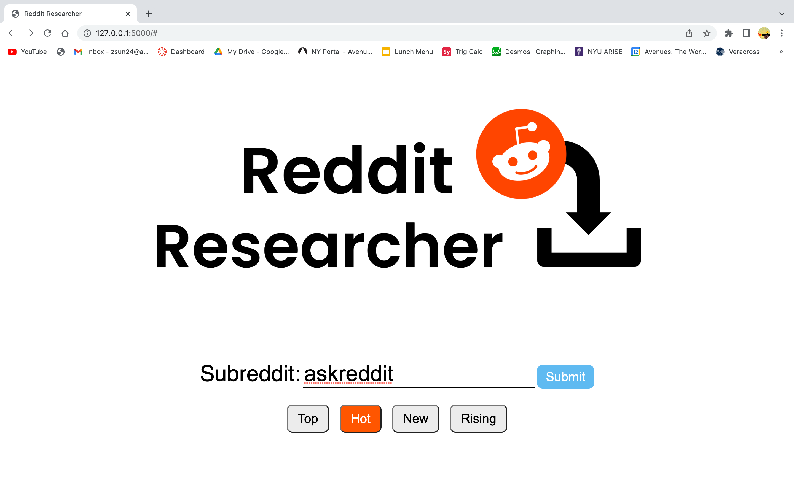
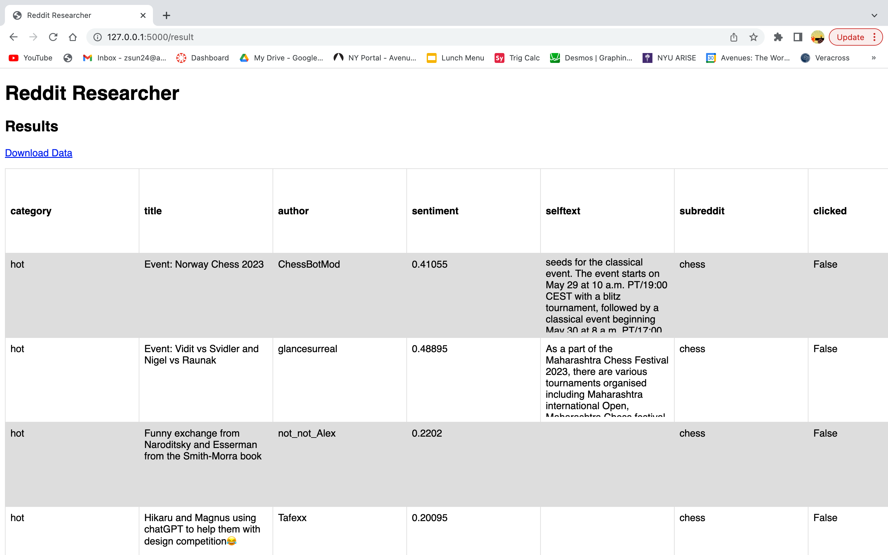

# Reddit Researcher

## Project Description
The Reddit Researcher is a webapplication based in Flask, that allows users to view and download posts, comments, and images from Reddit. Utilizing the Reddit API, Reddit Researcher is a one stop solution for getting data for researchers, essentially a webscraper with UI. This application features a sleek webpage design that allows users to search for specific information on Reddit, and filter and search for it. Some filters include specific subreddits, users, type of data (post, comments, images, etc) and the total amount of data. This also uses NLP to analyze the sentiment of each post, which provides another feature for this dataset. Finally, the data is displayed on the webpage, and users have the option to download it in a CSV format. 

## How to use the Website?
The Reddit Research website has a very simple user interface. Run the main.py python file to start the website. Start by typing in the subreddit you want to research. For example, you can type in "wallstreetbets" to search up the wallstreetbets subreddit. I recommend you search on Google to get the exact spelling of the subreddit. You can also choose one of the four categories to filter your posts. Next, press enter. You might need to wait a few seconds for the results to load. When it does, you will be redirected to the results page with a table featuring the data for all of the posts. You can also download this data in a CSV format by clicking download data. The table also features scrolling overflow.

**IMPORTANT**: In a couple of weeks, Reddit is making their API cost money. As a result, my website won't work, and many subreddits such as r/chess and r/ftc are now set on private to protest against these changes. So if you search up a private subreddit, it will say "Forbidden". I assure you, my code is not broken. Right now, the r/askreddit subreddit is working, so you can try that as an example.

## The Different Files
### main.py
The main python file running the flask webpage. 

### reddit.py
The python file running webscraping algorithms.

### nlp.py
The python file running sentiment analysis algorithms.

### home.html
The html file for the home page.

### result.html
The html file for the result page.

### home.css
The css file for the homepage design.

### home.js
The javascript file for the home page, controlling the button functionalities.
